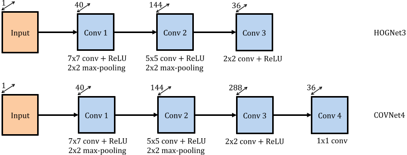
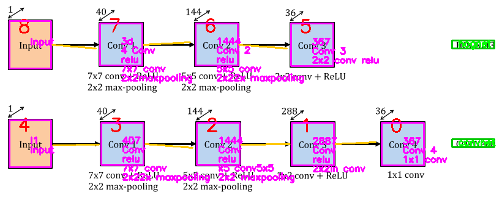

# Image2Graph

## How to run?

The required packages are listed in [requirements.txt](requirements.txt). The following command could be used to install these packages in the target Python environment:

```
pip install -r requirements.txt
```

### Detailed Instructions

Below are more detailed sample commands to create a new environment named 'i2g' using conda command line, to install the requirements, and to run the notebook using this new environment as its kernel:

```
conda create --name i2g
activate i2g
cd 'path-to-image2graph-folder'
pip install -r requirements.txt
python -m ipykernel install --user --name=i2g
jupyter notebook
```

Select the kernel 'i2g' in the notebook.

### OS Based Differences

<b>For Windows:</b> 

Tesseract needs to be installed using the installer from the following link: https://github.com/UB-Mannheim/tesseract/wiki
Please make sure that the following line of code is uncommented in the notebook, and has the correct path to the tesseract executable in your local.

```
pytesseract.pytesseract.tesseract_cmd = r"C:\Program Files\Tesseract-OCR\tesseract.exe"
```

<b>For Linux based systems:</b> 

Please make sure that the above line is commented in the notebook.

If you encounter any issues, please feel free to contact the authors.

## Notebook

We provide a [notebook](FigAnalysis/ShapeExtraction/DemoScript.ipynb) implementing the image analysis (shape, text and arrow detection), as detailed in our [report](reports/milestone3/). Sample input images are provided in the [input folder](FigAnalysis/ShapeExtraction/Input/), and the outputs that are generated by the notebook are saved to the [output folders](FigAnalysis/ShapeExtraction/Output/). The notebook generates two outputs for each input image:

- An output image annotating the detected shapes, text and arrows (located in the [OpImage folder](FigAnalysis/ShapeExtraction/Output/OpImage)).
- A list of relationships (graph) between the detected components (located in the [OpGraph folder](FigAnalysis/ShapeExtraction/Output/OpGraph)).

To run the notebook on new images, it is sufficient to replace the contents of the [input folder](FigAnalysis/ShapeExtraction/Input/) with the new images to test. A sample input image and corresponding outputs are provided below:

Input Image:
<p align="center">
 
</p>

Output Image:
<p align="center">
 
</p>

Output Graph:

```
Component number 6 has text: 1444  
Component number 6 has text: Conv 2  
Component number 6 has text: ReLU  
Component number 6 has text: 5x5 conv  
Component number 6 has text: 2x22x maxpooling  
Component number 7 has text: 5d 
Component number 7 has text: 4 Conv  
Component number 7 has text: ReLU  
Component number 7 has text: 7x7 conv  
Component number 7 has text: 2x2maxpooling 
Component number 5 has text: 367 
Component number 5 has text: Conv 3  
Component number 5 has text: 2x2 conv ReLU  
Component number 8 has text: Input  
Component number 4 has text: l1 
Component number 4 has text: Input  
Component number 3 has text: 407 
Component number 3 has text: Conv  
Component number 3 has text: ReLU  
Component number 3 has text: 7x7 conv  
Component number 3 has text: 2x22x maxpooling  
Component number 2 has text: 1444 
Component number 2 has text: Conv  
Component number 2 has text: ReLU  
Component number 2 has text: 5x5 conv  
Component number 2 has text: 2x2 maxpooling  
Component number 1 has text: 2887 
Component number 1 has text: Conv  
Component number 1 has text: ReLU  
Component number 1 has text: 2x2in conv  
Component number 0 has text: 367 
Component number 0 has text: Conv 4  
Component number 0 has text: 1x1 conv  
Text Component: hognet  
Text Component: convnet  
Component number 8 is connected to Component number 7 
Component number 3 is connected to Component number 4 
Component number 7 is connected to Component number 6 
Component number 3 is connected to Component number 2 
Component number 6 is connected to Component number 5 
Component number 2 is connected to Component number 1 
Component number 1 is connected to Component number 0
```
