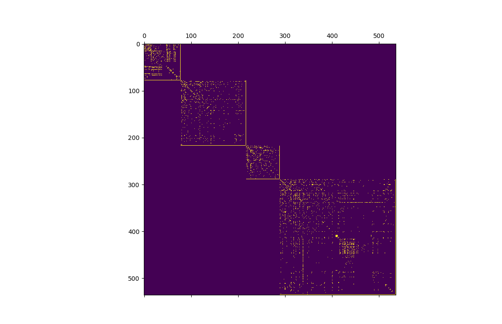
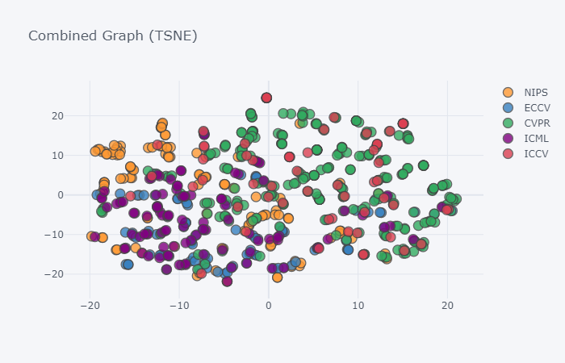

# Whole Graph Embeddings using GCNs
The key idea is to embed, using GCNs, the code2graph rdf graphs generated by UCI to show code similarity. GCNs can take multiple graphs with node attributes and do whole-graph embeddings. Here is a discussion and diagram taken from the original GCN implementation (https://github.com/tkipf/gcn/issues/4) showing how to do it:


The graph_generator.py has methods load_data() and load_combo() that format data from different modalities (separately or together) 
according to this specification for batch-wise training over multiple graph instances of different sizes. 
Below the resulting diagonal matrix for the first three rdf code2graphs. 
Note that the last node for each graph is the supernode solution described by Kipf (https://github.com/tkipf/gcn/issues/4).



## Node Features
The features are the tfidf representations of node names.

## Labels
We use information from the csv file with paper/repo information (pwc_edited_plt.csv) to generate the metadata.

## Requirements
1. gae https://github.com/tkipf/gae
2. gcn https://github.com/tkipf/gcn/tree/master/gcn (Not currenly used)

## Embeddings

We mainly utilized unsupervised learning with GAE. The experiments can be repeated using <gae_train.py>:
```
python gae_train.py 'dataset'
```
where 'dataset' is one of 'text','image','code' or 'combo'. The resulting embeddings and metadata for all nodes or for supernodes are generated in 'results' subfolder.
Note that to us combo the paths to triples files from individual modalities need to be updated in load_combo() function.

We performed some initial experiment with supervised learning with GCN (see <gcn_train.py>), but didn't pursue this further so the file is not up to date.

A notebook <EmbeddingDemo.ipynb> can be used to demonstrate visualization of supernode embedding results using TSNE (or other low dimensional embedding methods)

## Example output from GAE
The figure below shows the TSNE representation of the supernodes. Colors represent the conferences.
 However, note that these embeddings currently reflect the loss function used for link prediction. 




## Future Work
We had only limited time to explore this topic. Some further development can be:
1. Leveraging internal embeddings of GCN rather than using it as a classifier. 
2. Use GAE for whole graph embedding instead of link prediction.
3. Improve quantiy/quality of data (ie more/better triples) and of the better labels.
